<picture>
  <source media="(max-width: 700px)" srcset="./assets/hero-mobile.svg" />
  
</picture>

<p align="center">
  <a href="https://devpriyanshu.vercel.app/"></a>
  <a href="https://www.linkedin.com/in/priyanshukumar1265/"></a>
  <a href="mailto:priyanshu.dev.agile@gmail.com"></a>
  <a href="https://leetcode.com/u/PriyAnshu1265/"></a>
</p>

<p align="center">
  
</p>

## `~/about`

I'm a **Full Stack Engineer at Cognivac**. I build production web apps end to end, from the PostgreSQL schema and REST APIs to the deployed UI.

```yaml
focus:    LLM features that are safe to ship
          strict JSON schemas · validation · model failover · prompt-injection guarding
open_to:  SDE-1 · Full Stack · Backend · Noida, Delhi NCR, Bengaluru or remote
also:     450+ DSA problems · 5★ HackerRank (Java, SQL) · 1st place, CODE RUSH 2.0
```

## `~/projects`

<table>
  <tr>
    <td width="50%" valign="top">
      <h3><code>01</code> FoodCal · AI Nutrition Coach</h3>
      <p>Snap a meal photo to get a per-ingredient calorie and macro breakdown. Gemini returns a strict JSON schema, and the API re-checks the 4/4/9 macro math and rejects low-confidence reads. Targets come from a deterministic BMR/TDEE engine; the LLM only explains them.</p>
      <p><code>Next.js</code> <code>Spring Boot</code> <code>PostgreSQL</code> <code>Flyway</code> <code>Gemini</code> <code>Supabase</code> <code>Docker</code></p>
      <a href="https://foodcal-fn-three.vercel.app"><b>▸ live demo</b></a>
    </td>
    <td width="50%" valign="top">
      <h3><code>02</code> HireCheck · Online Assessments</h3>
      <p>Recruiters create timed tests, invite candidates by link, and review auto-evaluated scores and analytics. JWT auth and role-based access protect both the exam flow and admin operations.</p>
      <p><code>React</code> <code>TypeScript</code> <code>Spring Boot</code> <code>PostgreSQL</code> <code>JWT</code> <code>Docker</code></p>
      <a href="https://hirecheck-beryl.vercel.app"><b>▸ live demo</b></a> 
      . <a href="https://github.com/PriYanahsu/HireCheck-frontend"><b>▸ Frontend Code</b></a>
      · <a href="https://github.com/PriYanahsu/HireCheck-backend"><b>▸ Backend Code</b></a>
    </td>
    
  </tr>
  <tr>
    <td width="50%" valign="top">
      <h3><code>03</code> File Forge · Document Toolkit</h3>
      <p>All-in-one platform for file conversion, PDF generation and compression, backed by cloud storage.</p>
      <p><code>Next.js</code> <code>Supabase</code> <code>PDF processing</code></p>
      <a href="https://fileforge.online"><b>▸ live demo</b></a>
    </td>
    <td width="50%" valign="top">
      <h3><code>04</code> ML Disease Prediction</h3>
      <p>Machine-learning system that predicts likely diseases from symptoms and recommends drugs.</p>
      <p><code>Python</code> <code>scikit-learn</code> <code>ML</code></p>
      <a href="https://github.com/PriYanahsu/Disease-Prediction-with-Drug-Recommendation-Using-ML"><b>▸ code</b></a>
    </td>
  </tr>
</table>

## `~/work/cognivac`

```yaml
docqfy:          multi-tenant property audit platform · 3 role-based portals
                 40+ REST APIs with JWT and row-level ownership checks · 15+ table PostgreSQL schema
clinic_booking:  Spring Boot + Next.js · conflict-free self-booking · reminders on 3 channels
                 admin analytics dashboard
job_tracker:     browser extension + FastAPI backend · auto-captures Upwork jobs · 5-status pipeline
devvit_games:    4 Reddit word games · 50+ levels · player-made levels · Redis-backed progress
```

## `~/stack`

<p>
  
</p>

<details>
<summary><b>cat stack.md</b></summary>

| | |
|---|---|
| **Backend** | Java 21, Spring Boot 3, Spring Security, JPA/Hibernate, FastAPI, REST, OpenAPI, JWT, RBAC |
| **Frontend** | React, Next.js (App Router), TypeScript, Tailwind CSS, TanStack Query, Zustand |
| **Data** | PostgreSQL, Flyway, MySQL, Redis, Supabase, pgvector |
| **DevOps & testing** | Docker, GitHub Actions, AWS (EC2, RDS), Vercel, Render, JUnit 5, Mockito, Jest, Playwright |
| **AI** | Gemini and OpenAI APIs, structured outputs, RAG, prompt-injection guarding |

</details>

---

<p align="center">
  <code>$ echo "open to SDE-1 / Full Stack / Backend roles"</code><br/>
  Reach me at <a href="mailto:priyanshu.dev.agile@gmail.com">priyanshu.dev.agile@gmail.com</a> or on <a href="https://www.linkedin.com/in/priyanshukumar1265/">LinkedIn</a>.
</p>
