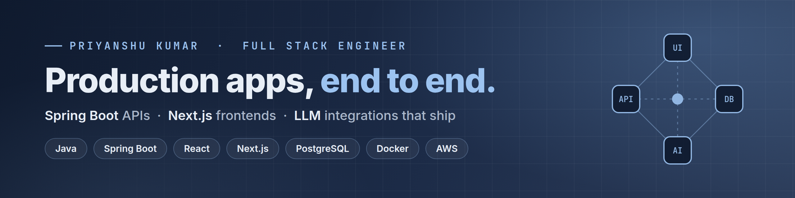

<picture>
  <source media="(max-width: 700px)" srcset="./assets/banner-mobile.png" />
  
</picture>

  
  
  
  

## About me

I'm a **Full Stack Engineer at Cognivac**. I build production web apps end to end, from the PostgreSQL schema and REST APIs to the deployed UI.

- 🛠️ **Day to day:** Java / Spring Boot and FastAPI backends, React / Next.js frontends, PostgreSQL, Docker, AWS
- 🤖 **Focus:** LLM features that are safe to ship: strict JSON schemas, validation, model failover and prompt-injection guarding
- 🎯 **Open to:** SDE-1, Full Stack and Backend roles in Noida, Delhi NCR, Bengaluru or remote
- 🏆 **Also:** 450+ DSA problems · 5★ HackerRank (Java, SQL) · 1st place, CODE RUSH 2.0 hackathon

## Featured projects

### 🥗 FoodCal: AI Nutrition Coach
Snap a meal photo to get a per-ingredient calorie and macro breakdown. Gemini returns a strict JSON schema, and the API re-checks the 4/4/9 macro math and rejects low-confidence reads. Targets come from a deterministic BMR/TDEE engine; the LLM only explains them.

`Next.js` `Spring Boot` `PostgreSQL` `Flyway` `Gemini` `Supabase` `Docker` 
**[Live demo →](https://foodcal-fn-three.vercel.app)**

### 📝 HireCheck: Online Assessment Platform
Recruiters create timed tests, invite candidates by link, and review auto-evaluated scores and analytics. JWT auth and role-based access protect both the exam flow and admin operations.

`React` `TypeScript` `Spring Boot` `PostgreSQL` `JWT` `Docker` 
**[Live demo →](https://hirecheck-beryl.vercel.app)** · **[Code](https://github.com/PriYanahsu/HireCheck-Full-Stack-)**

### 📄 File Forge: Document Toolkit
All-in-one platform for file conversion, PDF generation and compression, backed by cloud storage.

`Next.js` `Supabase` `PDF processing` 
**[Live demo →](https://fileforge.online)**

### 🩺 ML Disease Prediction
Machine-learning system that predicts likely diseases from symptoms and recommends drugs.

`Python` `scikit-learn` `ML` 
**[Code →](https://github.com/PriYanahsu/Disease-Prediction-with-Drug-Recommendation-Using-ML)**

## At work: Cognivac

- **Docqfy:** a multi-tenant property audit platform with 3 role-based portals, 40+ REST APIs with JWT and row-level ownership checks, and a PostgreSQL schema of 15+ tables
- **Clinic Appointment System:** a Spring Boot + Next.js app with conflict-free self-booking, reminders on 3 channels and an admin analytics dashboard
- **Upwork Job Tracker:** a browser extension with a FastAPI backend that auto-captures job details and tracks each application across 5 statuses
- **Reddit Devvit Games:** 4 word games shipped with 50+ levels, player-made levels and Redis-backed progress

## Tech stack

  

- **Backend:** Java 21, Spring Boot 3, Spring Security, JPA/Hibernate, FastAPI, REST, OpenAPI, JWT, RBAC
- **Frontend:** React, Next.js (App Router), TypeScript, Tailwind CSS, TanStack Query, Zustand
- **Data:** PostgreSQL, Flyway, MySQL, Redis, Supabase, pgvector
- **DevOps & testing:** Docker, GitHub Actions, AWS (EC2, RDS), Vercel, Render, JUnit 5, Mockito, Jest, Playwright
- **AI:** Gemini and OpenAI APIs, structured outputs, RAG, prompt-injection guarding

## GitHub stats

  
  

  

---

  <i>Open to SDE-1 / Full Stack / Backend roles.</i> 
  <a href="mailto:priyanshu.dev.agile@gmail.com">priyanshu.dev.agile@gmail.com</a> · <a href="https://www.linkedin.com/in/priyanshukumar1265/">LinkedIn</a>

